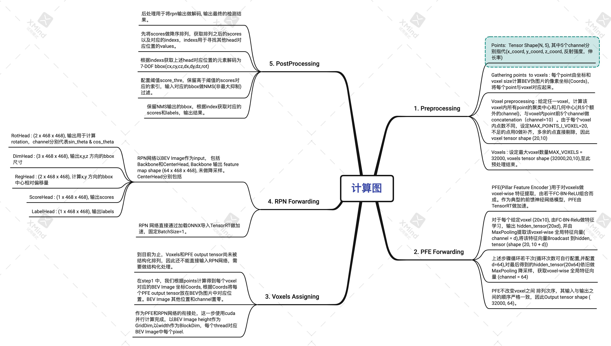
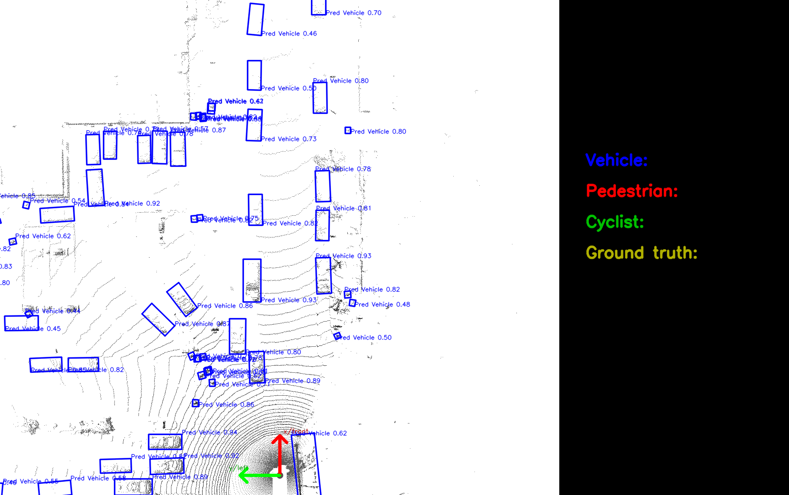
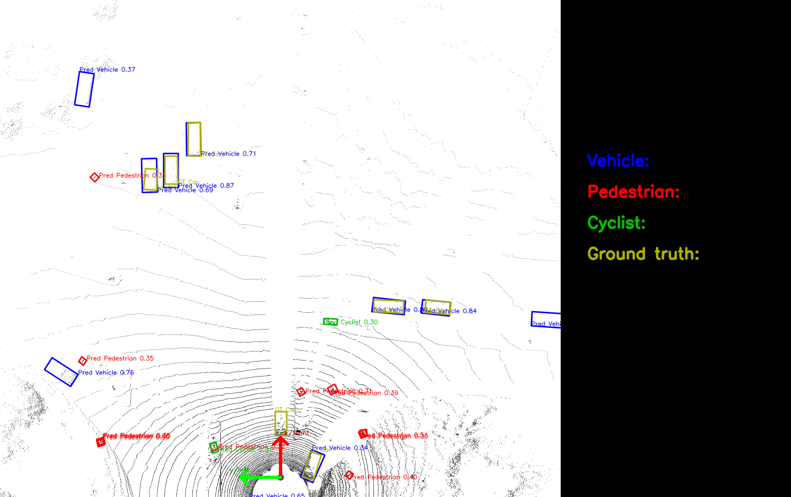
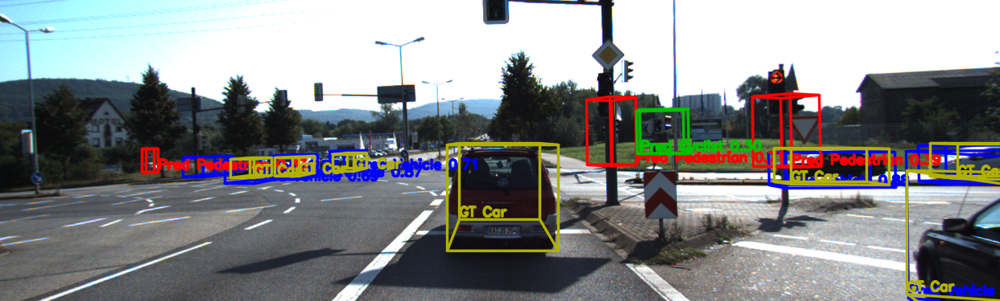

# CenterPoint —— 基于 ONNX Runtime / MNN 的激光雷达 3D 目标检测

CenterPoint 是一种基于鸟瞰图（BEV）中心点的 3D 目标检测模型，本项目支持
**ONNX Runtime** 与 **MNN** 两套可互换推理后端，在 Waymo Open Dataset 上完成端到端推理。

代码参考自 [tianweiy/CenterPoint](https://github.com/tianweiy/CenterPoint)。

---

## 推理流程

```
读取 .bin → 体素化（Pillar） → PFE 引擎 → 散射 → RPN 引擎 → 解码 + 旋转 NMS → TXT + BEV 可视化
```



---

## 环境依赖

已在 *Ubuntu 18.04 / 20.04* 上测试，主要依赖：

| 依赖 | 说明 |
|---|---|
| C++17 编译器、CMake ≥ 3.16 | 编译必须 |
| yaml-cpp | 配置解析：`conda install -c conda-forge yaml-cpp` |
| ONNX Runtime 或 MNN | 至少启用一个推理后端 |
| OpenCV（可选） | BEV 可视化 |

---

## 模型转换（PyTorch → ONNX → MNN）

`models/` 目录已提供使用
[waymo_centerpoint_pp_two_pfn_stride1_3x](https://github.com/tianweiy/CenterPoint/blob/master/configs/waymo/pp/waymo_centerpoint_pp_two_pfn_stride1_3x.py)
配置训练的 baseline 模型（ONNX + MNN 两种格式）。

若要导出自己的模型，先安装 `det3d`（仅导出时需要）：

```bash
bash tools/setup_det3d.sh           # 在当前环境安装
# 或创建独立 conda 环境
bash tools/setup_det3d.sh --create-env det3d
export PYTHONPATH=$(pwd)/tools:$PYTHONPATH
```

再使用一键转换脚本：

```bash
# 从 checkpoint 导出 ONNX 并转换为 MNN
bash convert_model.sh --ckpt latest.pth --to_onnx --to_mnn

# 仅把已有 ONNX 转换为 MNN
bash convert_model.sh --pfe_onnx models/pfe_baseline32000.onnx \
                      --rpn_onnx models/rpn_baseline.onnx --to_mnn
```

### Waymo 与 KITTI 主要参数对比

| 参数 | Waymo | KITTI |
|---|---|---|
| 点云范围（x） | −74.88 ∼ 74.88 m | 0 ∼ 69.12 m |
| 点云范围（y） | −74.88 ∼ 74.88 m | −39.68 ∼ 39.68 m |
| 体素尺寸（voxel_size） | 0.32 × 0.32 × 6.0 m | 0.16 × 0.16 × 4.0 m |
| BEV 尺寸 | 468 × 468 | 432 × 496 |
| 点特征维度 | 5（含 time_lag） | 4 |
| 最大 pillar 数 | 32 000 | 12 000 |
| 检测类别 | Vehicle / Pedestrian / Cyclist | Car / Pedestrian / Cyclist |

---

## 编译

```bash
# ONNX Runtime 后端
cmake -B build \
  -DUSE_ONNXRUNTIME=ON -DUSE_MNN=OFF -DUSE_OPENCV=ON \
  -DCMAKE_PREFIX_PATH=$CONDA_PREFIX \
  -DONNXRUNTIME_ROOT=ThirdParty/onnxruntime-linux-x64-1.16.3
cmake --build build -j4

# MNN 后端
cmake -B build_mnn \
  -DUSE_ONNXRUNTIME=OFF -DUSE_MNN=ON -DUSE_OPENCV=ON \
  -DCMAKE_PREFIX_PATH=$CONDA_PREFIX
cmake --build build_mnn -j4
```

---

## 运行推理

### C++ 推理

```bash
# ONNX Runtime
bash run_onnx.sh

# MNN（需编译时 -DUSE_MNN=ON）
bash run_mnn.sh

# 追加参数示例
bash run_mnn.sh --data-dir lidars --no-viz
```

两个脚本均从 `config/config_cpp.yaml` 读取配置；`--backend` 会自动切换模型路径后缀
（`.onnx` ↔ `.mnn`）并将结果分别写入 `output/cpp/onnx/` 与 `output/cpp/mnn/`。

### Python 推理（ONNX）

```bash
python tools/infer_onnx.py --config config/config_python.yaml
# 可选参数：--data_dir --save_dir --score_thresh --nms_thresh --no_viz
```

### 单样本模式（点云 + 相机图像）

```bash
bash run_sample.sh
```

读取 `data/` 中 KITTI 格式的点云、相机图像与标定文件，同时输出 BEV 鸟瞰图和相机 3D 框投影。

---

## 可视化结果

### BEV 鸟瞰图（MNN，Waymo 验证集）



### 单样本 BEV（KITTI 格式，含真值框）



### 相机图像 3D 框投影



---

## 评估指标（Waymo 验证集，score_threshold = 0.2）

| 配置 | Vehicle L2 mAP | Vehicle L2 mAPH | Pedestrian L2 mAP | Pedestrian L2 mAPH |
|---|---|---|---|---|
| fp32 + CPU pre/post | 0.7814 | 0.7240 | 0.6837 | 0.5668 |
| fp32 + GPU pre/post | 0.8039 | 0.7947 | 0.6723 | 0.5588 |
| fp16 + GPU pre/post | 0.8038 | 0.7945 | 0.6671 | 0.5541 |

> 上述数据为早期 TensorRT 实现的测量结果，供参考。当前 ONNX/MNN 实现的预处理 / 后处理在 CPU 执行，性能特征不同。

---

## 致谢

- [CenterPoint](https://github.com/tianweiy/CenterPoint)
- [TensorRT](https://github.com/NVIDIA/TensorRT/tree/master)
- [CenterPoint-PointPillars](https://github.com/CarkusL/CenterPoint)

---

## 联系方式

nchu_pgf@163.com
